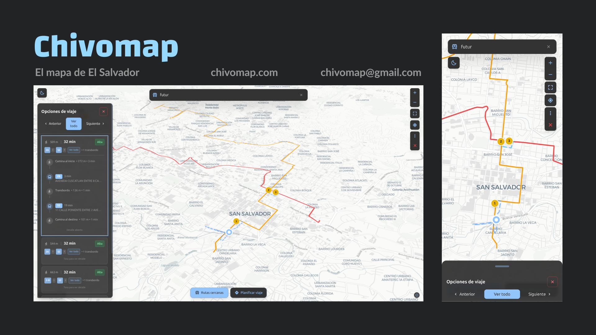
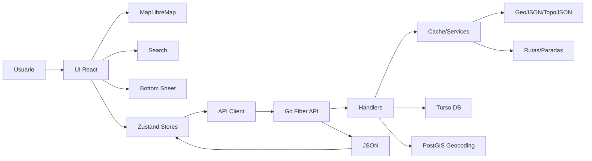

<h1 align="center">ChivoMap</h1>

<p align="center">
  <strong>Mapa interactivo de transporte público de El Salvador</strong>
</p>

<p align="center">
  <a href="https://github.com/chivomap/web/blob/main/LICENSE">
    
  </a>
  
  
  
  
</p>

<p align="center">
  Explora más de 3,000 rutas de buses, busca paradas cercanas y planifica viajes en transporte público a lo largo de todo El Salvador.
</p>

---

<p align="center">
  
</p>

## Funcionalidades

**Mapa**
- Visualización de rutas de buses con colores por tipo (urbano, interurbano, interdepartamental)
- Niveles de detalle adaptativos (LOD) según el zoom
- Temas claro/oscuro con mapas CartoDB
- Persistencia de viewport entre sesiones

**Búsqueda**
- Búsqueda unificada de rutas, lugares y regiones geográficas
- Fuzzy matching local para rutas (Fuse.js)
- Búsqueda de lugares vía API con distancia desde tu ubicación
- Navegación jerárquica: Departamento → Municipio → Distrito

**Transporte**
- Rutas cercanas basadas en geolocalización o ubicación seleccionada
- Paradas de bus con información detallada
- Planificador de viajes multi-modal (bus + caminata)
- Opciones de ruta con estimación de tiempo, distancia y transbordos

**Interacción**
- Long-press en móvil para colocar pins (con vibración háptica)
- Click derecho para menú contextual en desktop
- Bottom sheet con 3 estados (peek/half/full) y drag inteligente
- Geocoding inverso automático al seleccionar ubicaciones

## Stack Técnico

| Capa | Tecnología |
|------|-----------|
| Framework | React 18 + TypeScript |
| Mapa | MapLibre GL JS vía react-map-gl |
| Estado | Zustand (14 stores modulares) |
| Estilos | Tailwind CSS |
| Geo | Turf.js |
| Routing | Wouter |
| Build | Vite 5 |
| Paquetes | pnpm |

## Arquitectura



```
src/
├── pages/                # Páginas (Home, About, Export, Account)
├── hooks/                # Hooks custom (useBottomSheet, useGeolocation, useMapFocus)
└── shared/
    ├── components/
    │   ├── Map/          # MapLibreMap, controles, capas, bottom sheet
    │   ├── rutas/        # Capas de rutas y rutas cercanas
    │   ├── paradas/      # Capa de paradas
    │   └── ui/           # Componentes reutilizables
    ├── store/            # 14 stores Zustand
    ├── api/              # Clientes HTTP
    ├── services/         # Servicios de datos
    ├── types/            # Definiciones TypeScript
    ├── config/           # Variables de entorno
    └── data/             # Estilos de mapa
```

## Inicio Rápido

```bash
# Clonar
git clone https://github.com/chivomap/web.git
cd web

# Instalar dependencias
pnpm install

# Configurar variables de entorno
cp .env.example .env

# Desarrollo
pnpm dev

# Build
pnpm build
```

### Variables de Entorno

| Variable | Descripción | Default |
|----------|------------|---------|
| `VITE_API_URL` | URL del backend API | — |
| `VITE_MAP_DEFAULT_LAT` | Latitud inicial del mapa | `13.69` |
| `VITE_MAP_DEFAULT_LNG` | Longitud inicial del mapa | `-89.19` |
| `VITE_MAP_DEFAULT_ZOOM` | Zoom inicial | `9` |
| `VITE_FEATURE_TRIP_PLANNER` | Habilitar planificador de viajes | `false` |
| `VITE_FEATURE_ROUTE_ARROWS` | Flechas de dirección en rutas | `false` |

## Contribuir

Las contribuciones son bienvenidas. Este es un proyecto comunitario.

1. Fork el proyecto
2. Crea una rama (`git checkout -b feature/mi-feature`)
3. Commit tus cambios (`git commit -m 'Agregar mi feature'`)
4. Push (`git push origin feature/mi-feature`)
5. Abre un Pull Request

Ver [CONTRIBUTING.md](./CONTRIBUTING.md) para guías detalladas.

## Licencia

[AGPL-3.0](./LICENSE) — ChivoMap es y siempre será software libre y de código abierto. Si modificas el código o lo usas como servicio web, debes compartir el código fuente bajo la misma licencia.

## Autor

**Eliseo Arévalo** — [@eliseo-arevalo](https://github.com/eliseo-arevalo)

---

<p align="center">
  Parte de <a href="https://github.com/chivomap">ChivoMap</a> — Democratizando el acceso a datos de transporte en El Salvador.
</p>
